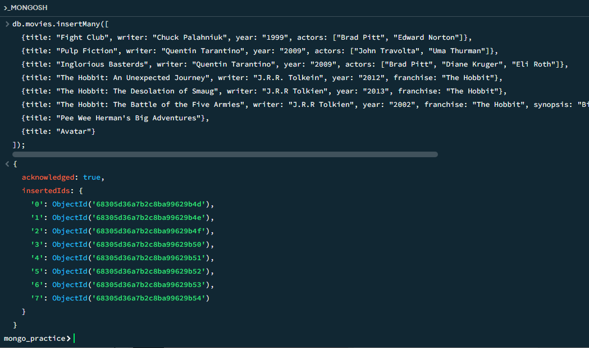
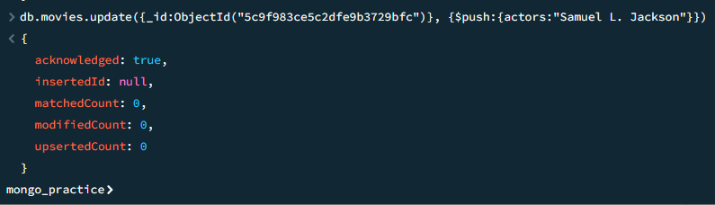
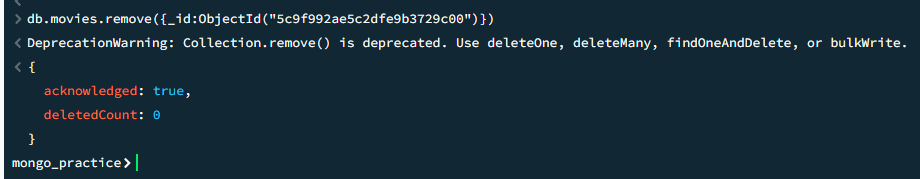
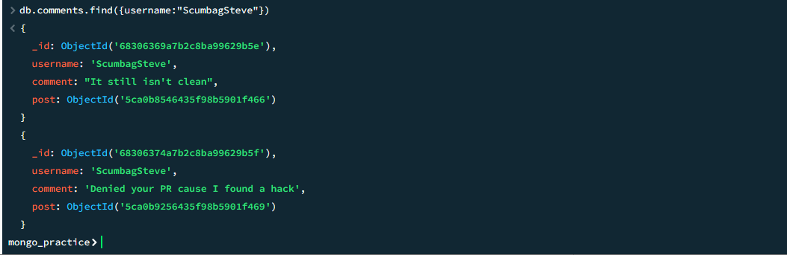

# Finals Lab Task 6 – Working with MongoDB

In this lab activity, I explored basic MongoDB operations such as inserting documents, querying data, performing updates, deletions, text searches, and managing relationships between collections. The goal was to simulate real-world scenarios like managing movies, users, posts, and comments.

Here are the steps I followed:

## Step 1 – Insert Documents
- Inserted multiple movie documents and user profiles using `insertMany()` to populate the database.

## Step 2 – Queries
- Used `find()` queries to retrieve specific documents filtered by fields like writer, actor, franchise, and year.

## Step 3 – Updates
- Used `update()` along with `$set` to modify existing documents by adding new fields such as synopses and actors.

## Step 4 – Text Search
- Performed text searches using regular expressions to locate or exclude keywords (e.g., included "Bilbo", excluded "Gandalf").

## Step 5 – Deletion
- Used `remove()` to delete specific documents, such as a movie with a certain title.

## Step 6 – Relationships
- 6-1. Users Collection
    - Code: db.users.insertMany([ {_id: 1, username: "GoodGuyGreg", first_name: "Good Guy", last_name: "Greg"}, {_id: 2, username: "ScumbagSteve", fullname: {first: "Scumbag", last: "Steve"}} ]);
- 6-2. Posts Collection
  - Code: db.posts.insertMany([ {username: "GoodGuyGreg", title: "Passes out at Party", body: "Raises your credit score"}, {username: "GoodGuyGreg", title: "Steals your identity", body: "Raises your credit score"}, {username: "GoodGuyGreg", title: "Reports a bug in your code", body: "Sends you a pull request"}, {username: "ScumbagSteve", title: "Borrows something", body: "Sells it"}, {username: "ScumbagSteve", title: "Borrows everything", body: "The end"}, {username: "ScumbagSteve", title: "Forks your repo on github", body: "Sets to private"} ]);
- 6-3 Comments Collection
    - Code: db.comments.insertMany([ {username: "GoodGuyGreg", comment: "Hope you got a good deal!", post: ObjectId("POST_ID_1")}, {username: "GoodGuyGreg", comment: "What's mine is yours!", post: ObjectId("POST_ID_2")}, {username: "GoodGuyGreg", comment: "Don't violate the licensing agreement!", post: ObjectId("POST_ID_3")}, {username: "ScumbagSteve", comment: "It still isn't clean", post: ObjectId("POST_ID_4")}, {username: "ScumbagSteve", comment: "Denied your PR cause I found a hack", post: ObjectId("POST_ID_5")} ]);
## Step 7 – Querying Related Collections
Queried user, post, and comment data by usernames to retrieve and display relational information.

